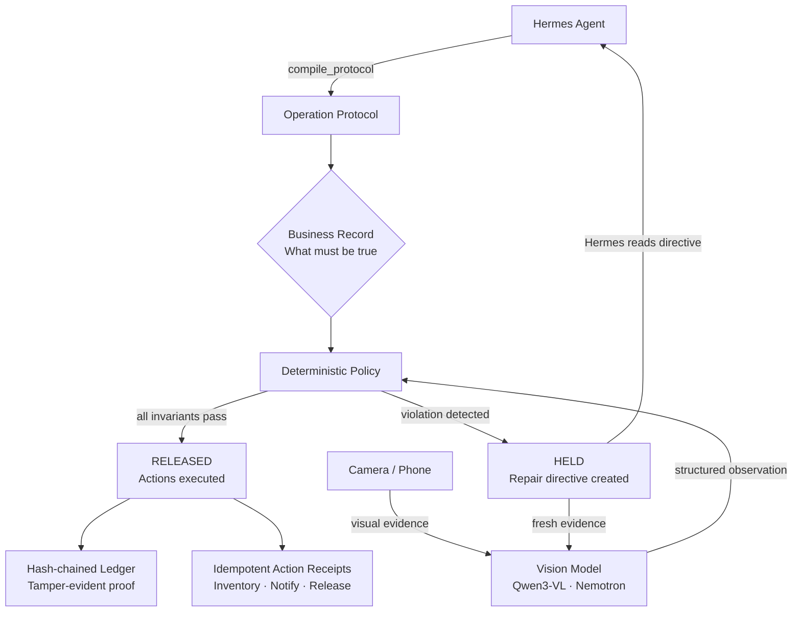

<div align="center">

# PARALLAX

### The autonomous reality reconciliation layer

**AI agents can automate digital workflows.**
**But who verifies the physical world?**

[](https://nousresearch.com)
[](https://typescriptlang.org)
[](https://react.dev)
[](https://modelcontextprotocol.io)

</div>

---

## The problem

Business software records what *should* have happened.  
Cameras see what *actually* happened.  
Nothing connects the two before an agent is allowed to continue.

A wrong item ships. A missing safety seal passes. A job that was never done gets marked complete. **PARALLAX is the verification layer that forces an agent to wait until physical reality matches the plan.**

---

## Hermes is the brain

PARALLAX does not make decisions autonomously. **Hermes Agent** is the orchestrator — it discovers the available MCP tools, selects the right protocol for the job, drives the full inspection-repair-release loop, and signs every action it takes.

```
┌─────────────────────────────────────────────────────────────────┐
│                        HERMES AGENT                             │
│                                                                 │
│   "What protocol applies here?"                                 │
│   "Run the inspection."                                         │
│   "Read the repair directive."                                  │
│   "Verify the corrected evidence."                              │
│   "Release when every invariant passes."                        │
│                                                                 │
│   ↓  7 MCP tools  ↓                                             │
└───────────────────┬─────────────────────────────────────────────┘
                    │
                    ▼
┌─────────────────────────────────────────────────────────────────┐
│                        PARALLAX ENGINE                          │
│                                                                 │
│   Vision model → structured observation                         │
│   Deterministic policy → HELD / RELEASED                        │
│   Idempotent actions → receipts + ledger                        │
└─────────────────────────────────────────────────────────────────┘
```

Hermes decides **what** to do. PARALLAX enforces **whether** it is safe to do it.

---

## How it works



---

## The model perceives. Policy decides. Hermes acts.

| Layer | Who does it | What it does |
|---|---|---|
| **Perception** | Vision model (Qwen3-VL / Nemotron) | Reads the camera, extracts visible facts |
| **Decision** | Deterministic code | Compares facts to invariants, no LLM vote |
| **Orchestration** | Hermes Agent via MCP | Drives the loop, signs every action |
| **Proof** | SHA-256 ledger | Every transition is independently verifiable |

> The LLM **never** decides whether a workflow continues. Deterministic invariants own that gate.

---

## Demo scenarios

### Warehouse fulfillment pack-out
A package must contain a red ceramic mug, a USB-C cable, and a warranty card before it ships.

| Evidence | Vision sees | Policy decides |
|---|---|---|
| First photo | Blue mug · No warranty card | HELD — 2 violations |
| Corrected photo | Red mug · Cable · Card | RELEASED |
| Damaged photo | Red mug cracked | HELD — condition mismatch |

### HVAC field-service closeout
A technician installs a filter but forgets the safety seal and service label.

| Evidence | Vision sees | Policy decides |
|---|---|---|
| First photo | Filter only | HELD — 2 missing controls |
| Corrected photo | Filter · Seal · Label | RELEASED — visit closed |

### Custom reference scenario *(any workflow)*
Take a photo of anything. PARALLAX learns the manifest automatically — no predefined objects, no code. Upload a second photo and it detects any deviation in real time.

---

## Quickstart

```bash
pnpm install
pnpm dev
```

Open **http://localhost:5173** — the full demo runs in fixture replay mode with no API key.

### Enable live vision

Copy `.env.example` to `.env` and add one key:

```bash
# Option A — Hugging Face (free)
HF_TOKEN=hf_...
HF_VISION_MODEL=Qwen/Qwen3-VL-30B-A3B-Instruct

# Option B — NVIDIA NIM
VISION_BASE_URL=https://integrate.api.nvidia.com/v1
VISION_API_KEY=nvapi-...
VISION_MODEL=nvidia/nemotron-3-nano-omni-30b-a3b-reasoning
```

### Run the Hermes autonomous demo

```bash
pnpm demo:hermes
```

Hermes discovers the 7 MCP tools, drives 4 inspection rounds autonomously, and returns a signed operational report.

---

## MCP tools exposed to Hermes

| Tool | Description |
|---|---|
| `get_operation_state` | Read protocol, manifest, status, metrics |
| `compile_protocol` | Activate a visual operation protocol |
| `inspect_fixture` | Run a verified visual fixture |
| `get_evidence_history` | Full inspection history with SHA-256 digests |
| `get_repair_directive` | Structured correction plan with steps |
| `verify_ledger` | Independently verify the hash-chained ledger |
| `reset_operation` | Reset to clean state |

---

## Architecture

```
c:\
├── server/
│   ├── index.ts          Express API · SSE broadcast · file upload
│   ├── engine.ts         Deterministic validation · SHA-256 ledger
│   ├── store.ts          Operation state machine
│   ├── vision.ts         HF / NVIDIA NIM / demo adapter
│   ├── actions.ts        Idempotent action executor · webhook outbox
│   ├── protocols.ts      Cross-industry protocol templates
│   ├── fixtures.ts       Verified visual benchmark fixtures
│   └── mcp.ts            7 stdio MCP tools for Hermes
├── src/                  React 19 · Framer Motion · real-time SSE
├── shared/types.ts       Shared TypeScript contracts
└── docs/                 Architecture · Runbook · Use cases
```

---

## Trust principles

- **Model perceives, policy decides.** No LLM controls the release gate.
- **Hermes operates, PARALLAX enforces.** The agent cannot bypass invariants.
- **Low confidence = no action.** Below threshold → `INSUFFICIENT_EVIDENCE`.
- **Fixture replay is declared.** Never passed off as live inference.
- **Every action has a proof.** Idempotent receipts + independently verifiable ledger.

---

## Verify

```bash
pnpm verify
```

Runs type-check · unit tests · MCP smoke test · live vision smoke test.

---

<div align="center">

**PARALLAX** — Turn any camera into an accountable operations endpoint.

</div>
